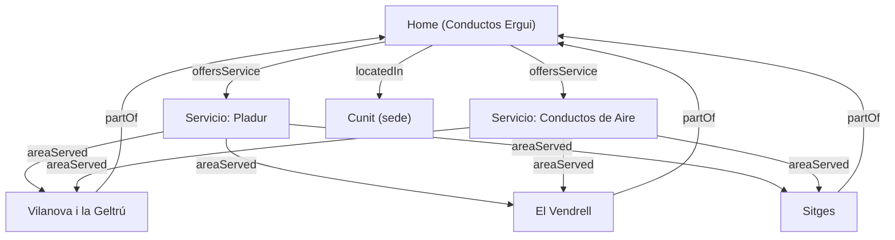

# Arquitectura de Silo Web — Conductos Ergui

## Objetivo

Definir la estructura jerárquica ("silo") de contenidos y URLs del sitio web de Conductos Ergui, agrupando los servicios principales (Pladur y Conductos de Aire) y las landings geográficas de las zonas de cobertura, para reforzar la relevancia temática y local (SEO semántico).

## Estructura en árbol de URLs

```
/ (Home)
├── /pladur/
│   ├── /pladur/vilanova-i-la-geltru/
│   ├── /pladur/el-vendrell/
│   └── /pladur/sitges/
├── /conductos-de-aire/
│   ├── /conductos-de-aire/vilanova-i-la-geltru/
│   ├── /conductos-de-aire/el-vendrell/
│   └── /conductos-de-aire/sitges/
├── /zonas/
│   ├── /zonas/vilanova-i-la-geltru/
│   ├── /zonas/el-vendrell/
│   └── /zonas/sitges/
├── /sobre-nosotros/
└── /contacto/
```

## Diagrama de relaciones lógicas (Mermaid)



## Descripción de relaciones

- **offersService**: conecta la Home con cada uno de los servicios principales (Pladur, Conductos de Aire).
- **locatedIn**: sitúa la entidad en Cunit, Tarragona, como base de operaciones.
- **areaServed**: vincula cada servicio con las landings geográficas dentro del radio de 50 km (Vilanova i la Geltrú, El Vendrell, Sitges, y por extensión Baix Penedès, Garraf, Alt Penedès, Tarragonès y Baix Llobregat).

## Landings geográficas prioritarias

1. Vilanova i la Geltrú
2. El Vendrell
3. Sitges

Estas landings combinan servicio + ubicación (ej. "Instalación de Pladur en Sitges") para maximizar la relevancia local dentro del silo temático correspondiente.
