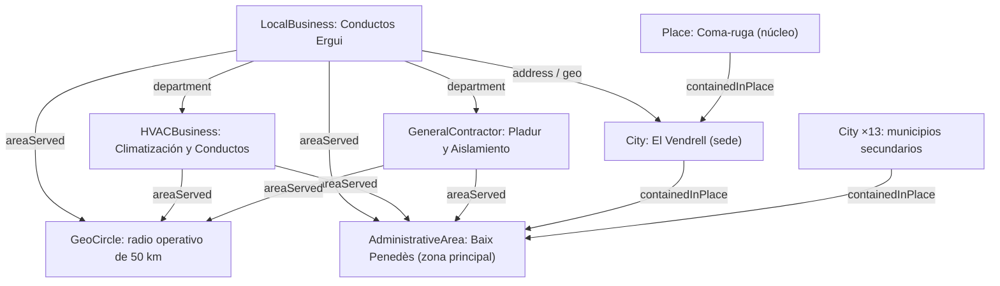

# Arquitectura de Silo Web — Conductos Ergui

## Objetivo

Definir la estructura jerárquica ("silo") de contenidos y URLs del sitio web de Conductos Ergui, agrupando los dos servicios principales y su contenido técnico de apoyo, para reforzar la relevancia temática y local (SEO semántico) en El Vendrell y la comarca del Baix Penedès.

## Silos semánticos

1. **Silo 1 — Climatización, instalación y mantenimiento de conductos** (`/#climatizacion`)
   - Temas: Conductos, HVAC, Mantenimiento.
2. **Silo 2 — Pladur, tabiquería y aislamiento** (`/#pladur`)
   - Temas: Pladur, Aislamiento.

## Estructura en árbol de URLs (estado actual)

```
/ (Home)
├── /servicios                Índice de servicios (CollectionPage)
│   ├── /servicios/climatizacion        Silo 1
│   ├── /servicios/conductos            Silo 1
│   ├── /servicios/ventilacion          Silo 1 (profundidad editorial limitada)
│   ├── /servicios/pladur               Silo 2
│   ├── /servicios/aislamiento-termico  Silo 2
│   └── /servicios/aislamiento-acustico Silo 2
├── #climatizacion            Silo 1
├── #pladur                   Silo 2
├── #cobertura                El Vendrell y Baix Penedès (enlaza a las páginas de zona)
├── /baix-penedes             Zona de servicio: 14 municipios, servicios y guías
├── /el-vendrell              Sede operativa; sección #coma-ruga (/coma-ruga redirige aquí, 308)
├── #contacto                 Formulario mailto
├── /temas/                    (indexables solo con ≥ 2 guías; el resto noindex, follow)
│   ├── /temas/conductos/          → Silo 1 · indexable
│   ├── /temas/hvac/               → Silo 1 · noindex
│   ├── /temas/mantenimiento/      → Silo 1 · noindex
│   ├── /temas/pladur/             → Silo 2 · noindex
│   └── /temas/aislamiento/        → Silo 2 · noindex
├── /guias/
│   └── /guias/[slug]/             Cada guía enlaza a su silo
├── /glosario/
├── /faq/                      FAQPage (solo preguntas verificadas)
├── /llms.txt                  Resumen para motores de IA
├── /presupuestador/
├── /compromiso/
├── /autor/bryan-ergui/       (/autor/aitor-ergui redirige aquí)
└── /legal/ (terminos, privacidad, cookies)
```

## Diagrama de relaciones lógicas (Mermaid)


```mermaid
graph TD
    Negocio["LocalBusiness: Conductos Ergui"]
    Clima["HVACBusiness: Climatización y Conductos"]
    Pladur["GeneralContractor: Pladur y Aislamiento"]
    Vendrell["City: El Vendrell (sede)"]
    ComaRuga["Place: Coma-ruga (núcleo)"]
    Comarca["AdministrativeArea: Baix Penedès (zona principal)"]
    Radio["GeoCircle: radio operativo de 50 km"]
    Secundarios["City ×13: municipios secundarios"]

    Negocio -->|department| Clima
    Negocio -->|department| Pladur
    Negocio -->|address / geo| Vendrell

    Negocio -->|areaServed| Radio
    Negocio -->|areaServed| Comarca
    Clima -->|areaServed| Radio
    Clima -->|areaServed| Comarca
    Pladur -->|areaServed| Radio
    Pladur -->|areaServed| Comarca

    Vendrell -->|containedInPlace| Comarca
    ComaRuga -->|containedInPlace| Vendrell
    Secundarios -->|containedInPlace| Comarca
```

## Descripción de relaciones

- **department**: conecta la entidad raíz (`Organization` · `LocalBusiness` · `HomeAndConstructionBusiness`) con cada silo (`HVACBusiness` y `GeneralContractor`).
- **parentOrganization**: relación inversa de cada silo hacia la entidad paraguas.
- **address / geo**: sitúa la entidad en El Vendrell (Tarragona) como base de operaciones.
- **areaServed** (ADR-001, D3/D5): GeoCircle de 50 km centrado en el local (`/#area-servida`) + Baix Penedès como zona principal. Se declara en la empresa, los departamentos y los 6 servicios.
- **containedInPlace**: Coma-ruga forma parte de El Vendrell; El Vendrell y los 13 municipios secundarios forman parte del Baix Penedès, que forma parte de la provincia de Tarragona.

El grafo se genera en `src/lib/schema.ts` a partir de `src/lib/entidad.ts` y del registro territorial `src/lib/territorio.ts` (ADR-001). Los nodos comunes (sitio, entidad raíz, departamentos, servicios y lugares) se inyectan en el `<head>` desde el layout; cada página añade su nodo de página (`{url}#webpage`), su breadcrumb (`{url}#breadcrumb`) y sus nodos propios, y referencia la empresa (`/#negocio`), el sitio (`/#website`) y el fundador (`/autor/bryan-ergui#persona`) solo por `@id`. La copia de referencia de la home está en `/schema/home.jsonld` y el mapa completo en `/docs/knowledge-graph.md`.

## Páginas de zona (fase 4, opción A)

- `/baix-penedes`: página central de la comarca. Grafo: `WebPage` con `about` → `/#baix-penedes` y `/#negocio`; `mainEntity` → `ItemList` de los 14 municipios (El Vendrell + 13 secundarios declarados como `City` con `@id` `/#<clave>` solo en esta página).
- `/el-vendrell`: sede operativa. Grafo: `WebPage` con `about` → `/#el-vendrell` y `Place` Coma-ruga (`/el-vendrell#coma-ruga`, `containedInPlace` → El Vendrell); `mainEntity` → `/#negocio`.
- La empresa (`LocalBusiness`) se declara una sola vez (`/#negocio`) y estas páginas la referencian por `@id`; no se duplica.

## Territorio (ADR-001)

- **Sede:** El Vendrell (Coma-ruga, núcleo dependiente).
- **Área servida:** radio operativo de 50 km desde la sede.
- **Prioritarios** (página indexable y estrategia de autoridad): Baix Penedès y El Vendrell.
- **Secundarios:** territorios atendidos dentro del radio y confirmados por el titular, sin página propia. Hoy, los 13 municipios del Baix Penedès; los de fuera de la comarca se añaden al registro solo con confirmación del titular y no se listan en el sitio (D6).
- Un territorio secundario solo pasa a prioritario (con página) mediante una decisión registrada en el ADR. Invariantes verificados en cada build por `scripts/validar-grafo.mjs`.
