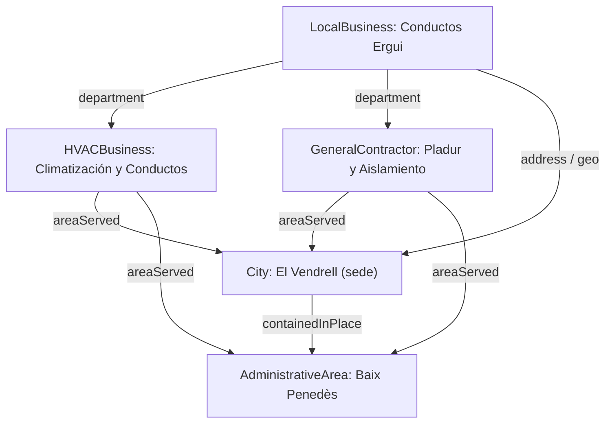

# Arquitectura de Silo Web — Conductos Ergui

## Objetivo

Definir la estructura jerárquica ("silo") de contenidos y URLs del sitio web de Conductos Ergui, agrupando los dos servicios principales y su contenido técnico de apoyo, para reforzar la relevancia temática y local (SEO semántico) en El Vendrell y la comarca del Baix Penedès.

## Silos semánticos

1. **Silo 1 — Climatización, instalación y mantenimiento de conductos** (`/#climatizacion`)
   - Temas: Conductos, HVAC, Mantenimiento.
2. **Silo 2 — Pladur, tabiquería y aislamiento** (`/#pladur`)
   - Temas: Pladur, Aislamiento.

## Estructura en árbol de URLs (estado actual)

```
/ (Home)
├── #climatizacion            Silo 1
├── #pladur                   Silo 2
├── #cobertura                El Vendrell y Baix Penedès
├── #contacto                 Formulario mailto
├── /temas/
│   ├── /temas/conductos/          → Silo 1
│   ├── /temas/hvac/               → Silo 1
│   ├── /temas/mantenimiento/      → Silo 1
│   ├── /temas/pladur/             → Silo 2
│   └── /temas/aislamiento/        → Silo 2
├── /guias/
│   └── /guias/[slug]/             Cada guía enlaza a su silo
├── /glosario/
├── /faq/
├── /presupuestador/
├── /compromiso/
├── /autor/aitor-ergui/
└── /legal/ (terminos, privacidad, cookies)
```

## Diagrama de relaciones lógicas (Mermaid)


```mermaid
graph TD
    Negocio["LocalBusiness: Conductos Ergui"]
    Clima["HVACBusiness: Climatización y Conductos"]
    Pladur["GeneralContractor: Pladur y Aislamiento"]
    Vendrell["City: El Vendrell (sede)"]
    Comarca["AdministrativeArea: Baix Penedès"]

    Negocio -->|department| Clima
    Negocio -->|department| Pladur
    Negocio -->|address / geo| Vendrell

    Clima -->|areaServed| Vendrell
    Clima -->|areaServed| Comarca
    Pladur -->|areaServed| Vendrell
    Pladur -->|areaServed| Comarca

    Vendrell -->|containedInPlace| Comarca
```

## Descripción de relaciones

- **department**: conecta la entidad raíz (`Organization` · `LocalBusiness` · `HomeAndConstructionBusiness`) con cada silo (`HVACBusiness` y `GeneralContractor`).
- **parentOrganization**: relación inversa de cada silo hacia la entidad paraguas.
- **address / geo**: sitúa la entidad en El Vendrell (Tarragona) como base de operaciones.
- **areaServed**: limita el área de servicio a El Vendrell y la comarca del Baix Penedès.
- **containedInPlace**: El Vendrell forma parte del Baix Penedès, que forma parte de la provincia de Tarragona.

El grafo se genera en `src/lib/schema.ts` a partir de `src/lib/entidad.ts`. Los nodos comunes (sitio, entidad raíz, departamentos, servicios y lugares) se inyectan en el `<head>` desde el layout; cada página añade su nodo de página (`{url}#webpage`), su breadcrumb (`{url}#breadcrumb`) y sus nodos propios, y referencia la empresa (`/#negocio`), el sitio (`/#website`) y el autor (`/autor/aitor-ergui#persona`) solo por `@id`. La copia de referencia de la home está en `/schema/home.jsonld`.

## Próxima expansión (landings geográficas)

Páginas servicio + municipio dentro del Baix Penedès (por ejemplo, "Climatización por conductos en Calafell"), creadas solo cuando exista contenido propio para cada una:

1. El Vendrell
2. Calafell
3. Cunit
