# Knowledge Graph — Conductos Ergui

Documento generado a partir del build de producción (fase 2; cifras actualizadas en la fase 3). Fuente del grafo: `src/lib/schema.ts`,
con datos de `src/lib/entidad.ts`, `src/data/conceptos.ts`, `src/data/servicios.ts` y `src/data/guias.ts`.

## Cifras (28 rutas verificadas)

- Nodos con `@id` únicos en todo el sitio: **143** (fase 2: 91; la fase 3 añade 46 Question y 7 FAQPage)
- Aristas únicas entre nodos con `@id`: **362** (fase 2: 304)
- Referencias sin resolver: **0**
- Nodos por página: entre 30 y 76 (el grafo común se repite en cada página para que sea autosuficiente; /faq es la más extensa)

## Capas

| Capa | Nodos | `@id` |
|---|---|---|
| Identidad | Empresa (Organization · LocalBusiness · HomeAndConstructionBusiness), WebSite, Person (fundador), 2 departamentos, logo | `/#negocio`, `/#website`, `/autor/bryan-ergui#persona`, `/#climatizacion`, `/#pladur`, `/#logo` |
| Servicios | 6 Service, 3 OfferCatalog | `/servicios/{slug}#servicio`, `/servicios#catalogo*` |
| Conceptos | 9 DefinedTerm en 1 DefinedTermSet | `/glosario#{concepto}`, `/glosario#terminos` |
| Territorio | El Vendrell (City), Baix Penedès, Provincia de Tarragona, Cataluña | `/#el-vendrell`, `/#baix-penedes`, `/#provincia-de-tarragona`, `/#cataluna` |
| Contenido | 6 BlogPosting, 28 nodos de página, 21 BreadcrumbList, 7 ItemList | `{url}#articulo`, `{url}#webpage`, `{url}#breadcrumb` |
| Respuestas (AEO) | 46 Question publicadas en /faq (FAQPage) y FAQPage por servicio (`hasPart`) | `/faq#{id}`, `/servicios/{slug}#faq` |
| Evidencia | — (bloqueada por falta de datos reales; ver `docs/backlog.md`) | — |

## Reglas de modelado

1. La empresa, el sitio, el fundador, los servicios y los conceptos se declaran una sola vez con `@id` estable; el resto los referencia por `@id`.
2. Cada servicio y cada concepto tiene URL propia con contenido visible (`/servicios/*`, `/glosario#*`).
3. `about` = tema principal; `mentions` = tema secundario. Las páginas de servicio solo muestran guías cuyo `about` coincide con sus conceptos.
4. `sameAs` solo con URIs verificadas. Hoy: ninguna en conceptos ni personas (bloqueadores B1 y B6).
5. La normativa citada se tipa como `CreativeWork` (`citation`), no como organización.

## Mapa completo (generado desde el build)

Se agregan las 6 guías y los 5 temas en un nodo cada uno; se omiten nodos de página, breadcrumbs y listas.

```mermaid
graph LR
  n0["baix-penedes · AdministrativeArea"] -->|containedInPlace| n1["provincia-de-tarragona · AdministrativeArea"]
  n2["HVACBusiness<br/>Climatización y Conductos"] -->|areaServed| n0["baix-penedes · AdministrativeArea"]
  n2["HVACBusiness<br/>Climatización y Conductos"] -->|areaServed| n3["el-vendrell · City"]
  n2["HVACBusiness<br/>Climatización y Conductos"] -->|hasOfferCatalog| n4["OfferCatalog clima"]
  n2["HVACBusiness<br/>Climatización y Conductos"] -->|knowsAbout| n5((climatizacion))
  n2["HVACBusiness<br/>Climatización y Conductos"] -->|knowsAbout| n6((conducto-de-aire))
  n2["HVACBusiness<br/>Climatización y Conductos"] -->|knowsAbout| n7((extraccion-de-humos))
  n2["HVACBusiness<br/>Climatización y Conductos"] -->|knowsAbout| n8((mantenimiento-de-instalaciones-termicas))
  n2["HVACBusiness<br/>Climatización y Conductos"] -->|knowsAbout| n9((ventilacion))
  n2["HVACBusiness<br/>Climatización y Conductos"] -->|parentOrganization| n10["Conductos Ergui<br/>Organization · LocalBusiness · HomeAndConstructionBusiness"]
  n3["el-vendrell · City"] -->|containedInPlace| n0["baix-penedes · AdministrativeArea"]
  n10["Conductos Ergui<br/>Organization · LocalBusiness · HomeAndConstructionBusiness"] -->|areaServed| n0["baix-penedes · AdministrativeArea"]
  n10["Conductos Ergui<br/>Organization · LocalBusiness · HomeAndConstructionBusiness"] -->|areaServed| n3["el-vendrell · City"]
  n10["Conductos Ergui<br/>Organization · LocalBusiness · HomeAndConstructionBusiness"] -->|contactPoint| n0["baix-penedes · AdministrativeArea"]
  n10["Conductos Ergui<br/>Organization · LocalBusiness · HomeAndConstructionBusiness"] -->|contactPoint| n3["el-vendrell · City"]
  n10["Conductos Ergui<br/>Organization · LocalBusiness · HomeAndConstructionBusiness"] -->|department| n2["HVACBusiness<br/>Climatización y Conductos"]
  n10["Conductos Ergui<br/>Organization · LocalBusiness · HomeAndConstructionBusiness"] -->|department| n11["GeneralContractor<br/>Pladur y Aislamiento"]
  n10["Conductos Ergui<br/>Organization · LocalBusiness · HomeAndConstructionBusiness"] -->|founder| n12["Bryan Ergui · Person<br/>Fundador"]
  n10["Conductos Ergui<br/>Organization · LocalBusiness · HomeAndConstructionBusiness"] -->|hasOfferCatalog| n13["OfferCatalog raíz"]
  n10["Conductos Ergui<br/>Organization · LocalBusiness · HomeAndConstructionBusiness"] -->|knowsAbout| n14((aislamiento-acustico))
  n10["Conductos Ergui<br/>Organization · LocalBusiness · HomeAndConstructionBusiness"] -->|knowsAbout| n15((aislamiento-termico))
  n10["Conductos Ergui<br/>Organization · LocalBusiness · HomeAndConstructionBusiness"] -->|knowsAbout| n5((climatizacion))
  n10["Conductos Ergui<br/>Organization · LocalBusiness · HomeAndConstructionBusiness"] -->|knowsAbout| n6((conducto-de-aire))
  n10["Conductos Ergui<br/>Organization · LocalBusiness · HomeAndConstructionBusiness"] -->|knowsAbout| n16((eficiencia-energetica))
  n10["Conductos Ergui<br/>Organization · LocalBusiness · HomeAndConstructionBusiness"] -->|knowsAbout| n7((extraccion-de-humos))
  n10["Conductos Ergui<br/>Organization · LocalBusiness · HomeAndConstructionBusiness"] -->|knowsAbout| n8((mantenimiento-de-instalaciones-termicas))
  n10["Conductos Ergui<br/>Organization · LocalBusiness · HomeAndConstructionBusiness"] -->|knowsAbout| n17((placa-de-yeso-laminado))
  n10["Conductos Ergui<br/>Organization · LocalBusiness · HomeAndConstructionBusiness"] -->|knowsAbout| n9((ventilacion))
  n11["GeneralContractor<br/>Pladur y Aislamiento"] -->|areaServed| n0["baix-penedes · AdministrativeArea"]
  n11["GeneralContractor<br/>Pladur y Aislamiento"] -->|areaServed| n3["el-vendrell · City"]
  n11["GeneralContractor<br/>Pladur y Aislamiento"] -->|hasOfferCatalog| n18["OfferCatalog pladur"]
  n11["GeneralContractor<br/>Pladur y Aislamiento"] -->|knowsAbout| n14((aislamiento-acustico))
  n11["GeneralContractor<br/>Pladur y Aislamiento"] -->|knowsAbout| n15((aislamiento-termico))
  n11["GeneralContractor<br/>Pladur y Aislamiento"] -->|knowsAbout| n17((placa-de-yeso-laminado))
  n11["GeneralContractor<br/>Pladur y Aislamiento"] -->|parentOrganization| n10["Conductos Ergui<br/>Organization · LocalBusiness · HomeAndConstructionBusiness"]
  n1["provincia-de-tarragona · AdministrativeArea"] -->|containedInPlace| n19["cataluna · AdministrativeArea"]
  n20["WebSite"] -->|about| n10["Conductos Ergui<br/>Organization · LocalBusiness · HomeAndConstructionBusiness"]
  n20["WebSite"] -->|publisher| n10["Conductos Ergui<br/>Organization · LocalBusiness · HomeAndConstructionBusiness"]
  n12["Bryan Ergui · Person<br/>Fundador"] -->|knowsAbout| n14((aislamiento-acustico))
  n12["Bryan Ergui · Person<br/>Fundador"] -->|knowsAbout| n15((aislamiento-termico))
  n12["Bryan Ergui · Person<br/>Fundador"] -->|knowsAbout| n5((climatizacion))
  n12["Bryan Ergui · Person<br/>Fundador"] -->|knowsAbout| n6((conducto-de-aire))
  n12["Bryan Ergui · Person<br/>Fundador"] -->|knowsAbout| n16((eficiencia-energetica))
  n12["Bryan Ergui · Person<br/>Fundador"] -->|knowsAbout| n7((extraccion-de-humos))
  n12["Bryan Ergui · Person<br/>Fundador"] -->|knowsAbout| n8((mantenimiento-de-instalaciones-termicas))
  n12["Bryan Ergui · Person<br/>Fundador"] -->|knowsAbout| n17((placa-de-yeso-laminado))
  n12["Bryan Ergui · Person<br/>Fundador"] -->|knowsAbout| n9((ventilacion))
  n12["Bryan Ergui · Person<br/>Fundador"] -->|worksFor| n10["Conductos Ergui<br/>Organization · LocalBusiness · HomeAndConstructionBusiness"]
  n21["DefinedTermSet<br/>Glosario"] -->|publisher| n10["Conductos Ergui<br/>Organization · LocalBusiness · HomeAndConstructionBusiness"]
  n13["OfferCatalog raíz"] -->|itemListElement| n4["OfferCatalog clima"]
  n13["OfferCatalog raíz"] -->|itemListElement| n18["OfferCatalog pladur"]
  n4["OfferCatalog clima"] -->|itemListElement| n22["Service · climatizacion"]
  n4["OfferCatalog clima"] -->|itemListElement| n23["Service · conductos"]
  n4["OfferCatalog clima"] -->|itemListElement| n24["Service · ventilacion"]
  n18["OfferCatalog pladur"] -->|itemListElement| n25["Service · aislamiento-acustico"]
  n18["OfferCatalog pladur"] -->|itemListElement| n26["Service · aislamiento-termico"]
  n18["OfferCatalog pladur"] -->|itemListElement| n27["Service · pladur"]
  n25["Service · aislamiento-acustico"] -->|areaServed| n0["baix-penedes · AdministrativeArea"]
  n25["Service · aislamiento-acustico"] -->|areaServed| n3["el-vendrell · City"]
  n25["Service · aislamiento-acustico"] -->|category| n14((aislamiento-acustico))
  n25["Service · aislamiento-acustico"] -->|isRelatedTo| n26["Service · aislamiento-termico"]
  n25["Service · aislamiento-acustico"] -->|isRelatedTo| n27["Service · pladur"]
  n25["Service · aislamiento-acustico"] -->|provider| n11["GeneralContractor<br/>Pladur y Aislamiento"]
  n26["Service · aislamiento-termico"] -->|areaServed| n0["baix-penedes · AdministrativeArea"]
  n26["Service · aislamiento-termico"] -->|areaServed| n3["el-vendrell · City"]
  n26["Service · aislamiento-termico"] -->|category| n15((aislamiento-termico))
  n26["Service · aislamiento-termico"] -->|category| n16((eficiencia-energetica))
  n26["Service · aislamiento-termico"] -->|isRelatedTo| n25["Service · aislamiento-acustico"]
  n26["Service · aislamiento-termico"] -->|isRelatedTo| n22["Service · climatizacion"]
  n26["Service · aislamiento-termico"] -->|isRelatedTo| n27["Service · pladur"]
  n26["Service · aislamiento-termico"] -->|provider| n11["GeneralContractor<br/>Pladur y Aislamiento"]
  n22["Service · climatizacion"] -->|areaServed| n0["baix-penedes · AdministrativeArea"]
  n22["Service · climatizacion"] -->|areaServed| n3["el-vendrell · City"]
  n22["Service · climatizacion"] -->|category| n5((climatizacion))
  n22["Service · climatizacion"] -->|category| n16((eficiencia-energetica))
  n22["Service · climatizacion"] -->|category| n8((mantenimiento-de-instalaciones-termicas))
  n22["Service · climatizacion"] -->|isRelatedTo| n26["Service · aislamiento-termico"]
  n22["Service · climatizacion"] -->|isRelatedTo| n23["Service · conductos"]
  n22["Service · climatizacion"] -->|provider| n2["HVACBusiness<br/>Climatización y Conductos"]
  n23["Service · conductos"] -->|areaServed| n0["baix-penedes · AdministrativeArea"]
  n23["Service · conductos"] -->|areaServed| n3["el-vendrell · City"]
  n23["Service · conductos"] -->|category| n6((conducto-de-aire))
  n23["Service · conductos"] -->|category| n8((mantenimiento-de-instalaciones-termicas))
  n23["Service · conductos"] -->|isRelatedTo| n22["Service · climatizacion"]
  n23["Service · conductos"] -->|isRelatedTo| n27["Service · pladur"]
  n23["Service · conductos"] -->|isRelatedTo| n24["Service · ventilacion"]
  n23["Service · conductos"] -->|provider| n2["HVACBusiness<br/>Climatización y Conductos"]
  n27["Service · pladur"] -->|areaServed| n0["baix-penedes · AdministrativeArea"]
  n27["Service · pladur"] -->|areaServed| n3["el-vendrell · City"]
  n27["Service · pladur"] -->|category| n17((placa-de-yeso-laminado))
  n27["Service · pladur"] -->|isRelatedTo| n25["Service · aislamiento-acustico"]
  n27["Service · pladur"] -->|isRelatedTo| n26["Service · aislamiento-termico"]
  n27["Service · pladur"] -->|isRelatedTo| n23["Service · conductos"]
  n27["Service · pladur"] -->|provider| n11["GeneralContractor<br/>Pladur y Aislamiento"]
  n24["Service · ventilacion"] -->|areaServed| n0["baix-penedes · AdministrativeArea"]
  n24["Service · ventilacion"] -->|areaServed| n3["el-vendrell · City"]
  n24["Service · ventilacion"] -->|category| n7((extraccion-de-humos))
  n24["Service · ventilacion"] -->|category| n9((ventilacion))
  n24["Service · ventilacion"] -->|isRelatedTo| n23["Service · conductos"]
  n24["Service · ventilacion"] -->|provider| n2["HVACBusiness<br/>Climatización y Conductos"]
  guias["Guías ×6 · BlogPosting"] -->|about ×1| n14((aislamiento-acustico))
  guias["Guías ×6 · BlogPosting"] -->|about ×1| n15((aislamiento-termico))
  guias["Guías ×6 · BlogPosting"] -->|about ×2| n17((placa-de-yeso-laminado))
  guias["Guías ×6 · BlogPosting"] -->|about ×3| n6((conducto-de-aire))
  guias["Guías ×6 · BlogPosting"] -->|about ×1| n5((climatizacion))
  guias["Guías ×6 · BlogPosting"] -->|about ×1| n16((eficiencia-energetica))
  guias["Guías ×6 · BlogPosting"] -->|about ×2| n8((mantenimiento-de-instalaciones-termicas))
  guias["Guías ×6 · BlogPosting"] -->|author ×6| n12["Bryan Ergui · Person<br/>Fundador"]
  guias["Guías ×6 · BlogPosting"] -->|mentions ×3| n16((eficiencia-energetica))
  guias["Guías ×6 · BlogPosting"] -->|mentions ×4| n9((ventilacion))
  guias["Guías ×6 · BlogPosting"] -->|mentions ×1| n6((conducto-de-aire))
  guias["Guías ×6 · BlogPosting"] -->|mentions ×1| n8((mantenimiento-de-instalaciones-termicas))
  guias["Guías ×6 · BlogPosting"] -->|mentions ×2| n5((climatizacion))
  temas["Temas ×5 · CollectionPage"] -->|about ×1| n14((aislamiento-acustico))
  temas["Temas ×5 · CollectionPage"] -->|about ×1| n15((aislamiento-termico))
  temas["Temas ×5 · CollectionPage"] -->|about ×1| n6((conducto-de-aire))
  temas["Temas ×5 · CollectionPage"] -->|about ×1| n5((climatizacion))
  temas["Temas ×5 · CollectionPage"] -->|about ×1| n16((eficiencia-energetica))
  temas["Temas ×5 · CollectionPage"] -->|about ×1| n8((mantenimiento-de-instalaciones-termicas))
  temas["Temas ×5 · CollectionPage"] -->|about ×1| n17((placa-de-yeso-laminado))
```

