# Knowledge Graph — Conductos Ergui

Documento generado a partir del build de producción (actualizado el 10/10/2026, tras ADR-001 I2–I4). Fuente del grafo: `src/lib/schema.ts`,
con datos de `src/lib/entidad.ts`, `src/lib/territorio.ts` (registro territorial canónico), `src/data/conceptos.ts`, `src/data/servicios.ts` y `src/data/guias.ts`.
La integridad se comprueba en cada compilación con `scripts/validar-grafo.mjs` (`npm run build`).

## Cifras (30 rutas verificadas)

- Nodos con `@id` únicos en todo el sitio: **163** (fase 3: 143; fase 4 + ADR-001 I2: +6 de páginas de zona y Coma-ruga, +1 GeoCircle, +13 municipios secundarios)
- Aristas únicas entre nodos con `@id`: **402**
- Referencias sin resolver: **0**
- Nodos por página: entre 31 y 77 (el grafo común se repite en cada página para que sea autosuficiente; /faq es la más extensa)

## Capas

| Capa | Nodos | `@id` |
|---|---|---|
| Identidad | Empresa (Organization · LocalBusiness · HomeAndConstructionBusiness), WebSite, Person (fundador), 2 departamentos, logo | `/#negocio`, `/#website`, `/autor/bryan-ergui#persona`, `/#climatizacion`, `/#pladur`, `/#logo` |
| Servicios | 6 Service, 3 OfferCatalog | `/servicios/{slug}#servicio`, `/servicios#catalogo*` |
| Conceptos | 9 DefinedTerm en 1 DefinedTermSet | `/glosario#{concepto}`, `/glosario#terminos` |
| Territorio (ADR-001) | Sede: El Vendrell (City) con el núcleo Coma-ruga (Place). Área servida: GeoCircle de 50 km. Prioritarios: Baix Penedès y El Vendrell. Secundarios: 13 municipios del Baix Penedès (City). Contexto: Provincia de Tarragona y Cataluña | `/#el-vendrell`, `/el-vendrell#coma-ruga`, `/#area-servida`, `/#baix-penedes`, `/#<clave>`, `/#provincia-de-tarragona`, `/#cataluna` |
| Contenido | 6 BlogPosting, nodos de página, 23 BreadcrumbList, 8 ItemList | `{url}#articulo`, `{url}#webpage`, `{url}#breadcrumb` |
| Respuestas (AEO) | 46 Question publicadas en /faq (FAQPage) y FAQPage por servicio (`hasPart`) | `/faq#{id}`, `/servicios/{slug}#faq` |
| Evidencia | — (bloqueada por falta de datos reales; ver `docs/backlog.md`) | — |

## Reglas de modelado

1. La empresa, el sitio, el fundador, los servicios y los conceptos se declaran una sola vez con `@id` estable; el resto los referencia por `@id`.
2. Cada servicio y cada concepto tiene URL propia con contenido visible (`/servicios/*`, `/glosario#*`).
3. `about` = tema principal; `mentions` = tema secundario. Las páginas de servicio solo muestran guías cuyo `about` coincide con sus conceptos.
4. `sameAs` solo con URIs verificadas. Hoy: Wikipedia en El Vendrell y Baix Penedès; ficha de Google Business Profile en la empresa; ninguna en conceptos, fundador ni municipios secundarios (bloqueadores B1 y B6).
5. La normativa citada se tipa como `CreativeWork` (`citation`), no como organización.
6. Territorio (ADR-001): todo lugar sale del registro `src/lib/territorio.ts`. `areaServed` = GeoCircle de 50 km + Baix Penedès en la empresa, los departamentos y los servicios. Solo los territorios prioritarios tienen página propia. Los municipios secundarios se declaran únicamente en `/baix-penedes`. Una página puede ampliar un nodo común con el mismo `@id`, pero nunca contradecir el valor de una propiedad.

## Mapa completo (generado desde el build)

Se agregan las 6 guías, los 5 temas y los 13 municipios secundarios en un nodo cada uno; se omiten nodos de página, breadcrumbs, listas y preguntas.

```mermaid
graph LR
  n0["Bryan Ergui · Person<br/>Fundador"] -->|knowsAbout| n1((climatizacion))
  n0["Bryan Ergui · Person<br/>Fundador"] -->|knowsAbout| n2((conducto-de-aire))
  n0["Bryan Ergui · Person<br/>Fundador"] -->|knowsAbout| n3((ventilacion))
  n0["Bryan Ergui · Person<br/>Fundador"] -->|knowsAbout| n4((extraccion-de-humos))
  n0["Bryan Ergui · Person<br/>Fundador"] -->|knowsAbout| n5((placa-de-yeso-laminado))
  n0["Bryan Ergui · Person<br/>Fundador"] -->|knowsAbout| n6((aislamiento-termico))
  n0["Bryan Ergui · Person<br/>Fundador"] -->|knowsAbout| n7((aislamiento-acustico))
  n0["Bryan Ergui · Person<br/>Fundador"] -->|knowsAbout| n8((eficiencia-energetica))
  n0["Bryan Ergui · Person<br/>Fundador"] -->|knowsAbout| n9((mantenimiento-de-instalaciones-termicas))
  n0["Bryan Ergui · Person<br/>Fundador"] -->|worksFor| n10["Conductos Ergui<br/>Organization · LocalBusiness · HomeAndConstructionBusiness"]
  n10["Conductos Ergui<br/>Organization · LocalBusiness · HomeAndConstructionBusiness"] -->|areaServed| n11["GeoCircle · radio operativo 50 km"]
  n10["Conductos Ergui<br/>Organization · LocalBusiness · HomeAndConstructionBusiness"] -->|areaServed| n12["baix-penedes · AdministrativeArea"]
  n10["Conductos Ergui<br/>Organization · LocalBusiness · HomeAndConstructionBusiness"] -->|department| n13["HVACBusiness<br/>Climatización y Conductos"]
  n10["Conductos Ergui<br/>Organization · LocalBusiness · HomeAndConstructionBusiness"] -->|department| n14["GeneralContractor<br/>Pladur y Aislamiento"]
  n10["Conductos Ergui<br/>Organization · LocalBusiness · HomeAndConstructionBusiness"] -->|founder| n0["Bryan Ergui · Person<br/>Fundador"]
  n10["Conductos Ergui<br/>Organization · LocalBusiness · HomeAndConstructionBusiness"] -->|hasOfferCatalog| n15["OfferCatalog raíz"]
  n10["Conductos Ergui<br/>Organization · LocalBusiness · HomeAndConstructionBusiness"] -->|knowsAbout| n1((climatizacion))
  n10["Conductos Ergui<br/>Organization · LocalBusiness · HomeAndConstructionBusiness"] -->|knowsAbout| n2((conducto-de-aire))
  n10["Conductos Ergui<br/>Organization · LocalBusiness · HomeAndConstructionBusiness"] -->|knowsAbout| n3((ventilacion))
  n10["Conductos Ergui<br/>Organization · LocalBusiness · HomeAndConstructionBusiness"] -->|knowsAbout| n4((extraccion-de-humos))
  n10["Conductos Ergui<br/>Organization · LocalBusiness · HomeAndConstructionBusiness"] -->|knowsAbout| n5((placa-de-yeso-laminado))
  n10["Conductos Ergui<br/>Organization · LocalBusiness · HomeAndConstructionBusiness"] -->|knowsAbout| n6((aislamiento-termico))
  n10["Conductos Ergui<br/>Organization · LocalBusiness · HomeAndConstructionBusiness"] -->|knowsAbout| n7((aislamiento-acustico))
  n10["Conductos Ergui<br/>Organization · LocalBusiness · HomeAndConstructionBusiness"] -->|knowsAbout| n8((eficiencia-energetica))
  n10["Conductos Ergui<br/>Organization · LocalBusiness · HomeAndConstructionBusiness"] -->|knowsAbout| n9((mantenimiento-de-instalaciones-termicas))
  n16["DefinedTermSet<br/>Glosario"] -->|hasDefinedTerm| n1((climatizacion))
  n16["DefinedTermSet<br/>Glosario"] -->|hasDefinedTerm| n2((conducto-de-aire))
  n16["DefinedTermSet<br/>Glosario"] -->|hasDefinedTerm| n3((ventilacion))
  n16["DefinedTermSet<br/>Glosario"] -->|hasDefinedTerm| n4((extraccion-de-humos))
  n16["DefinedTermSet<br/>Glosario"] -->|hasDefinedTerm| n5((placa-de-yeso-laminado))
  n16["DefinedTermSet<br/>Glosario"] -->|hasDefinedTerm| n6((aislamiento-termico))
  n16["DefinedTermSet<br/>Glosario"] -->|hasDefinedTerm| n7((aislamiento-acustico))
  n16["DefinedTermSet<br/>Glosario"] -->|hasDefinedTerm| n8((eficiencia-energetica))
  n16["DefinedTermSet<br/>Glosario"] -->|hasDefinedTerm| n9((mantenimiento-de-instalaciones-termicas))
  n16["DefinedTermSet<br/>Glosario"] -->|publisher| n10["Conductos Ergui<br/>Organization · LocalBusiness · HomeAndConstructionBusiness"]
  n14["GeneralContractor<br/>Pladur y Aislamiento"] -->|areaServed| n11["GeoCircle · radio operativo 50 km"]
  n14["GeneralContractor<br/>Pladur y Aislamiento"] -->|areaServed| n12["baix-penedes · AdministrativeArea"]
  n14["GeneralContractor<br/>Pladur y Aislamiento"] -->|hasOfferCatalog| n17["OfferCatalog pladur"]
  n14["GeneralContractor<br/>Pladur y Aislamiento"] -->|knowsAbout| n5((placa-de-yeso-laminado))
  n14["GeneralContractor<br/>Pladur y Aislamiento"] -->|knowsAbout| n6((aislamiento-termico))
  n14["GeneralContractor<br/>Pladur y Aislamiento"] -->|knowsAbout| n7((aislamiento-acustico))
  n14["GeneralContractor<br/>Pladur y Aislamiento"] -->|parentOrganization| n10["Conductos Ergui<br/>Organization · LocalBusiness · HomeAndConstructionBusiness"]
  n13["HVACBusiness<br/>Climatización y Conductos"] -->|areaServed| n11["GeoCircle · radio operativo 50 km"]
  n13["HVACBusiness<br/>Climatización y Conductos"] -->|areaServed| n12["baix-penedes · AdministrativeArea"]
  n13["HVACBusiness<br/>Climatización y Conductos"] -->|hasOfferCatalog| n18["OfferCatalog clima"]
  n13["HVACBusiness<br/>Climatización y Conductos"] -->|knowsAbout| n1((climatizacion))
  n13["HVACBusiness<br/>Climatización y Conductos"] -->|knowsAbout| n2((conducto-de-aire))
  n13["HVACBusiness<br/>Climatización y Conductos"] -->|knowsAbout| n3((ventilacion))
  n13["HVACBusiness<br/>Climatización y Conductos"] -->|knowsAbout| n4((extraccion-de-humos))
  n13["HVACBusiness<br/>Climatización y Conductos"] -->|knowsAbout| n9((mantenimiento-de-instalaciones-termicas))
  n13["HVACBusiness<br/>Climatización y Conductos"] -->|parentOrganization| n10["Conductos Ergui<br/>Organization · LocalBusiness · HomeAndConstructionBusiness"]
  n15["OfferCatalog raíz"] -->|itemListElement| n18["OfferCatalog clima"]
  n15["OfferCatalog raíz"] -->|itemListElement| n17["OfferCatalog pladur"]
  n19["Service · aislamiento-acustico"] -->|areaServed| n11["GeoCircle · radio operativo 50 km"]
  n19["Service · aislamiento-acustico"] -->|areaServed| n12["baix-penedes · AdministrativeArea"]
  n19["Service · aislamiento-acustico"] -->|brand| n10["Conductos Ergui<br/>Organization · LocalBusiness · HomeAndConstructionBusiness"]
  n19["Service · aislamiento-acustico"] -->|category| n7((aislamiento-acustico))
  n19["Service · aislamiento-acustico"] -->|isRelatedTo| n20["Service · pladur"]
  n19["Service · aislamiento-acustico"] -->|isRelatedTo| n21["Service · aislamiento-termico"]
  n19["Service · aislamiento-acustico"] -->|provider| n14["GeneralContractor<br/>Pladur y Aislamiento"]
  n21["Service · aislamiento-termico"] -->|areaServed| n11["GeoCircle · radio operativo 50 km"]
  n21["Service · aislamiento-termico"] -->|areaServed| n12["baix-penedes · AdministrativeArea"]
  n21["Service · aislamiento-termico"] -->|brand| n10["Conductos Ergui<br/>Organization · LocalBusiness · HomeAndConstructionBusiness"]
  n21["Service · aislamiento-termico"] -->|category| n6((aislamiento-termico))
  n21["Service · aislamiento-termico"] -->|category| n8((eficiencia-energetica))
  n21["Service · aislamiento-termico"] -->|isRelatedTo| n20["Service · pladur"]
  n21["Service · aislamiento-termico"] -->|isRelatedTo| n22["Service · climatizacion"]
  n21["Service · aislamiento-termico"] -->|isRelatedTo| n19["Service · aislamiento-acustico"]
  n21["Service · aislamiento-termico"] -->|provider| n14["GeneralContractor<br/>Pladur y Aislamiento"]
  n22["Service · climatizacion"] -->|areaServed| n11["GeoCircle · radio operativo 50 km"]
  n22["Service · climatizacion"] -->|areaServed| n12["baix-penedes · AdministrativeArea"]
  n22["Service · climatizacion"] -->|brand| n10["Conductos Ergui<br/>Organization · LocalBusiness · HomeAndConstructionBusiness"]
  n22["Service · climatizacion"] -->|category| n1((climatizacion))
  n22["Service · climatizacion"] -->|category| n8((eficiencia-energetica))
  n22["Service · climatizacion"] -->|category| n9((mantenimiento-de-instalaciones-termicas))
  n22["Service · climatizacion"] -->|isRelatedTo| n23["Service · conductos"]
  n22["Service · climatizacion"] -->|isRelatedTo| n21["Service · aislamiento-termico"]
  n22["Service · climatizacion"] -->|provider| n13["HVACBusiness<br/>Climatización y Conductos"]
  n23["Service · conductos"] -->|areaServed| n11["GeoCircle · radio operativo 50 km"]
  n23["Service · conductos"] -->|areaServed| n12["baix-penedes · AdministrativeArea"]
  n23["Service · conductos"] -->|brand| n10["Conductos Ergui<br/>Organization · LocalBusiness · HomeAndConstructionBusiness"]
  n23["Service · conductos"] -->|category| n2((conducto-de-aire))
  n23["Service · conductos"] -->|category| n9((mantenimiento-de-instalaciones-termicas))
  n23["Service · conductos"] -->|isRelatedTo| n22["Service · climatizacion"]
  n23["Service · conductos"] -->|isRelatedTo| n24["Service · ventilacion"]
  n23["Service · conductos"] -->|isRelatedTo| n20["Service · pladur"]
  n23["Service · conductos"] -->|provider| n13["HVACBusiness<br/>Climatización y Conductos"]
  n20["Service · pladur"] -->|areaServed| n11["GeoCircle · radio operativo 50 km"]
  n20["Service · pladur"] -->|areaServed| n12["baix-penedes · AdministrativeArea"]
  n20["Service · pladur"] -->|brand| n10["Conductos Ergui<br/>Organization · LocalBusiness · HomeAndConstructionBusiness"]
  n20["Service · pladur"] -->|category| n5((placa-de-yeso-laminado))
  n20["Service · pladur"] -->|isRelatedTo| n23["Service · conductos"]
  n20["Service · pladur"] -->|isRelatedTo| n21["Service · aislamiento-termico"]
  n20["Service · pladur"] -->|isRelatedTo| n19["Service · aislamiento-acustico"]
  n20["Service · pladur"] -->|provider| n14["GeneralContractor<br/>Pladur y Aislamiento"]
  n24["Service · ventilacion"] -->|areaServed| n11["GeoCircle · radio operativo 50 km"]
  n24["Service · ventilacion"] -->|areaServed| n12["baix-penedes · AdministrativeArea"]
  n24["Service · ventilacion"] -->|brand| n10["Conductos Ergui<br/>Organization · LocalBusiness · HomeAndConstructionBusiness"]
  n24["Service · ventilacion"] -->|category| n3((ventilacion))
  n24["Service · ventilacion"] -->|category| n4((extraccion-de-humos))
  n24["Service · ventilacion"] -->|isRelatedTo| n23["Service · conductos"]
  n24["Service · ventilacion"] -->|provider| n13["HVACBusiness<br/>Climatización y Conductos"]
  n25["WebSite"] -->|about| n10["Conductos Ergui<br/>Organization · LocalBusiness · HomeAndConstructionBusiness"]
  n25["WebSite"] -->|publisher| n10["Conductos Ergui<br/>Organization · LocalBusiness · HomeAndConstructionBusiness"]
  n7((aislamiento-acustico)) -->|inDefinedTermSet| n16["DefinedTermSet<br/>Glosario"]
  n6((aislamiento-termico)) -->|inDefinedTermSet| n16["DefinedTermSet<br/>Glosario"]
  n12["baix-penedes · AdministrativeArea"] -->|containedInPlace| n26["provincia-de-tarragona · AdministrativeArea"]
  n1((climatizacion)) -->|inDefinedTermSet| n16["DefinedTermSet<br/>Glosario"]
  n27["coma-ruga · Place"] -->|containedInPlace| n28["el-vendrell · City"]
  n2((conducto-de-aire)) -->|inDefinedTermSet| n16["DefinedTermSet<br/>Glosario"]
  n8((eficiencia-energetica)) -->|inDefinedTermSet| n16["DefinedTermSet<br/>Glosario"]
  n28["el-vendrell · City"] -->|containedInPlace| n12["baix-penedes · AdministrativeArea"]
  n4((extraccion-de-humos)) -->|inDefinedTermSet| n16["DefinedTermSet<br/>Glosario"]
  n9((mantenimiento-de-instalaciones-termicas)) -->|inDefinedTermSet| n16["DefinedTermSet<br/>Glosario"]
  n5((placa-de-yeso-laminado)) -->|inDefinedTermSet| n16["DefinedTermSet<br/>Glosario"]
  n26["provincia-de-tarragona · AdministrativeArea"] -->|containedInPlace| n29["cataluna · AdministrativeArea"]
  n3((ventilacion)) -->|inDefinedTermSet| n16["DefinedTermSet<br/>Glosario"]
  secundarios["Municipios secundarios ×13 · City"] -->|containedInPlace ×13| n12["baix-penedes · AdministrativeArea"]
  guias["Guías ×6 · BlogPosting"] -->|about ×3| n2((conducto-de-aire))
  guias["Guías ×6 · BlogPosting"] -->|about ×2| n9((mantenimiento-de-instalaciones-termicas))
  guias["Guías ×6 · BlogPosting"] -->|mentions ×4| n3((ventilacion))
  guias["Guías ×6 · BlogPosting"] -->|mentions ×3| n8((eficiencia-energetica))
  guias["Guías ×6 · BlogPosting"] -->|mentions ×2| n1((climatizacion))
  guias["Guías ×6 · BlogPosting"] -->|author ×6| n0["Bryan Ergui · Person<br/>Fundador"]
  guias["Guías ×6 · BlogPosting"] -->|about ×1| n6((aislamiento-termico))
  guias["Guías ×6 · BlogPosting"] -->|about ×1| n7((aislamiento-acustico))
  guias["Guías ×6 · BlogPosting"] -->|about ×2| n5((placa-de-yeso-laminado))
  guias["Guías ×6 · BlogPosting"] -->|about ×1| n1((climatizacion))
  guias["Guías ×6 · BlogPosting"] -->|about ×1| n8((eficiencia-energetica))
  guias["Guías ×6 · BlogPosting"] -->|mentions ×1| n9((mantenimiento-de-instalaciones-termicas))
  guias["Guías ×6 · BlogPosting"] -->|mentions ×1| n2((conducto-de-aire))
  temas["Temas ×5 · CollectionPage"] -->|about ×1| n6((aislamiento-termico))
  temas["Temas ×5 · CollectionPage"] -->|about ×1| n7((aislamiento-acustico))
  temas["Temas ×5 · CollectionPage"] -->|about ×1| n9((mantenimiento-de-instalaciones-termicas))
  temas["Temas ×5 · CollectionPage"] -->|about ×1| n2((conducto-de-aire))
  temas["Temas ×5 · CollectionPage"] -->|about ×1| n5((placa-de-yeso-laminado))
  temas["Temas ×5 · CollectionPage"] -->|about ×1| n1((climatizacion))
  temas["Temas ×5 · CollectionPage"] -->|about ×1| n8((eficiencia-energetica))
```

